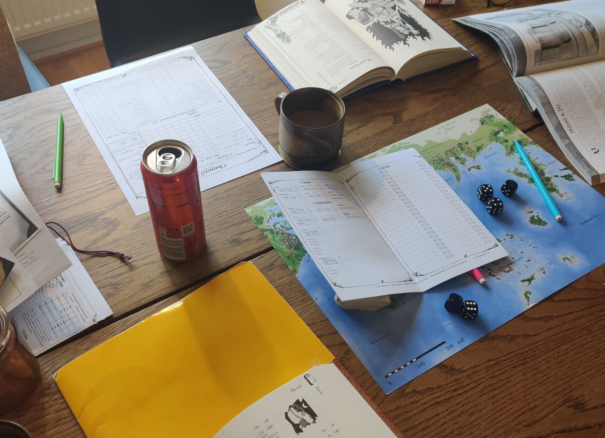
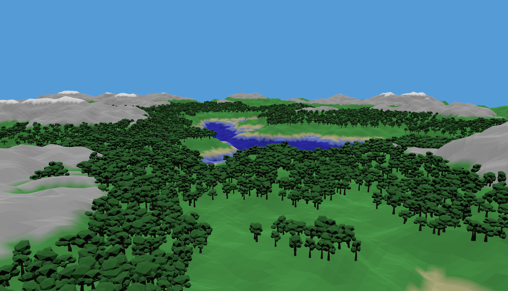

+++
title = "Creating Worlds in Bevy"
date = 2022-12-27
description = "Tabletop RPGs and a segue into procedural world generation in Bevy."

[taxonomies]
tags = ["Rust", "Bevy", "procgen"]

[extra]
footnote_backlinks = true
quick_navigation_buttons = true
+++

*You find yourself caught in a rainstorm as dusk falls. From behind the tree trunks, you notice a flickering light. **Torchlight**.*

*As you hear the chattering from the small goblin raid party, you realize this berry-harvest outing will end up being vastly more deadly than you planned…*

# A world imagined

I’m not a storywriter or a game designer by trade. Despite this I’ve always loved telling stories and weaving narratives. Historically, this has been around the table with my friends playing tabletop games.

As a gaming group, we’ve been through our fair share of systems. Each one providing new takes on how to create and shape narratives. Some systems are lean and depend more heavily on the group’s improvisational skills (***Fate***), while others provide more rigid frameworks that ushers the characters and stories in directions based on multiple moving parts and subsystems (***Burning Wheel***).



I’ve always been a fan of the more **procedural** systems. The same goes for my love for video games - despite it being a rough genre to like, I often prefer the unplanned and chaotic nature of survival games over games pushing you along a curated story.

There’s great beauty to be had in the drama created by independent game systems synergizing in unpredictable ways. You need but cast a quick glance at [Dwarf Fortress patch notes](https://www.pcgamer.com/the-most-ridiculous-patch-notes-from-10-years-of-dwarf-fortress/) to assure yourself of it.

# A world generated

So, what’s up with this long-ass preamble? The points I’m making form a line that points toward my first major undertaking on my Rust developer journey - Ymir.

**Ymir** is a very early and rigid implementation of a terrain generator plugin with a dummy system providing makeshift object placement. All in all, the performance is shoddy and the API is close to useless. It suffices as a proof of concept - nothing else. But boy, am I optimistic!



# What's next?

I really want to dig into it and talk about the specifics - inspirations, planned features, implementation details and technical unknowns - the whole nine yards!

Despite its infancy, some draft systems are in place. The landscape mesh generation is passable in its current state, but provides little-to-no information about the landscapes once generated. All it offers currently is a colored terrain with an attached collider. It’s cool, but hardly useful.

I want to make my next post about exploring the current implementation, discuss how it can be improved, and provide some code-along examples where I actually implement the improvements.

For now, I will leave you with this short code snippet, illustrating a very high-level and barely customized usage of the plugin to serve as an example.

To the seasoned Bevy enjoyer, it is a trivial code block.

To Ymir, it’s a peek of things to come.


```rust
fn main() {
    let mesh_config = MeshConfig::default();
    let noise_config = NoiseConfig::default();

    App::new()
        .add_plugin(DefaultPlugins)
        .add_plugin(bevy_ymir::YmirPlugin {
            mesh_config,
            noise_config,
        })
        .add_system(bevy_ymir::player::broadcast_player_position)
        .run();
}
```

***Thanks for reading! All the best,***<br/>
*Nilsiker*