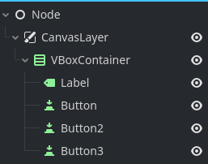
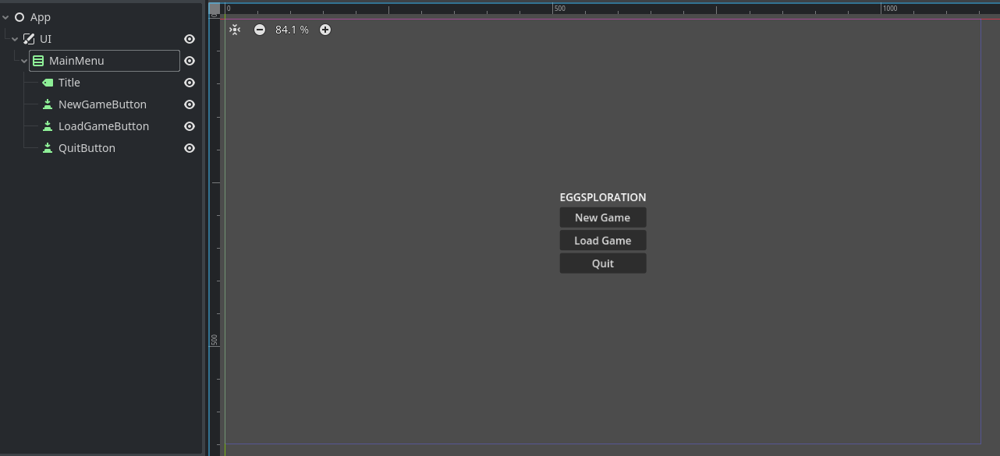

+++
title = "Exploring Chickensoft #1:  GodotEnv and GodotGame"
date = 2024-12-27
description = "Getting started with Chickensoft C# architecture in Godot."

[taxonomies]
tags = ["Godot", "C#", ".NET", "Chickensoft", "getting started"]

[extra]
footnote_backlinks = true
quick_navigation_buttons = true
+++

> 🙋🏼 A huge thanks goes out to Joanna May and all Chickensoft collaborators. Check out their [site](https://chickensoft.games/) and their truly impressive open-source tools for most things C# in Godot!

> ⚠️ This post assumes you have a basic understanding of Nodes and Scenes in Godot and are confident with C# syntax, if you plan to code along!

# Introduction

**Join me as I discover and try out the Chickensoft way of developing games in Godot!**

I often feel that my Godot projects slowly falls apart as I add more scripts and systems. We all know it - it's a classic architectural problem!

It usually starts with a bunch of GDScripts, and as things get tangled I start planning a move to C#. There's only so much namespace organization and interface decoupling can do, however...

I had yet to find a consistent way of implementing the features I have in mind. Returning to older projects always meant I had to rediscover what the heck Andreas was thinking - and that might have been more than six months ago.

Luckily, Chickensoft comes to the rescue! If you've dabbled in C# Godot, you might have run into their stuff already.

In short, the tools and guidelines provided by Chickensoft should provide you with a clean, extendible and testable architecture for your games. And I must say, the folks over at the organization has done a wonderful job showcasing the architecture and packages in their [GameDemo](https://github.com/chickensoft-games/GameDemo).

**However, taking it all in at once is quite daunting.**

In this series of posts, I hope to introduce the Chickensoft concepts, progressively adding them to a Chickensoft game template project as we run into good use cases.

> 🙋🏼 I'm not providing any golden paths or silver bullets here. I will be using the Chickensoft packages **as I understand them**, essentially recreating my personal journey learning these tools and patterns!

We'll start things off really simple! 🐔

# Scope

At the end of this post, we will have finished the following steps:

- Install a Godot C# version with the [GodotEnv CLI](https://github.com/chickensoft-games/GodotEnv)
- Create a project using the [GodotGame template](https://github.com/chickensoft-games/GodotGame)
- Prepare a scene structure for our game - starting with the `App` node and setting up a mock-up main menu.

We'll make stops along the way and rationalize not only how we perform these steps, but _why_ we do it.

We won't be explaining or describing every technical detail of the Chickensoft packages. I'll leave that up to the Chickensoft docs, which go into technical detail that I couldn't do justice with my current C# experience.

The goal is to build a foundational game structure, with an architecture that we can easily expand on using Chickensoft tools.

# Implementation

Arguably, the things we'll be sorting out in this part should be fairly simple.

We won't exactly get into the meat and bones of the Chickensoft packages in this post, but we will prepare a project for it.

Let's start by trying out the GodotEnv CLI!

## Installing Godot using GodotEnv

We'll start off with getting GodotEnv on our machine. As of writing this post, GodotEnv requires `net8.0`.

> 🙋🏼 Specifically, I'll be using .NET 8.0.404. It will work nicely with the package versions that are used in this series!

An argument for using GodotEnv is that it makes installing, uninstalling and switching between Godot versions a breeze. It also provides a way to manage addons.

Installing the GodotEnv tool is a sweet one-liner:

```bash
dotnet tool install --global Chickensoft.GodotEnv
```

With the tool installed, another one-liner helps us install Godot 4.3.0 (C#):

```bash
godotenv godot install 4.3.0 # adding -n would install the non-C# version.
```

That's it! We now have Godot 4.3.0 installed. You can confirm this by running:

```bash
godot --version
```

Now that Godot is installed, we'll swiftly move on to generating a project.

## Create a GodotGame template project

First off, we need to install the GodotGame template, allowing us to quickly scaffold Godot projects that comes with some boilerplate Chickensoft configuration.

Install the template like so:

```bash
dotnet new install Chickensoft.GodotGame
```

Then generate a new project using the template:

```bash
dotnet new chickengame --name "Eggsploration" --param:author "Andreas Nilsson"
```

I'm calling my project **Eggsploration**, so that we can finally get that inevitable pun out of the way. I'll set myself as the author/scapegoat.

We now have a Chickensoft game template project set up! Easy does it...

### Inspecting the default scenes

Before we make any changes, we should check out what the template actually generates for us.

Let's cd into the project and open it with the Godot editor.

```bash
cd Eggsploration # substitute with your project name!
godot -e
```

When running the game with F5, we are presented with a scene containing a test button:


Taking a closer look, we see this is actually the `Game.tscn` scene, not `Main.tscn` - the latter being a singular node with a script attached to it.

Reading the comments in `Main.cs`, we realize that the main scene is used to conditionally run tests. Let's skip the specifics for now, as we won't dive into the testing capabilities of Chickensoft at this point.

> 🙋🏼 I'm not fully sold on TDD. I'm sorry, Joanna...

At the end, the `Main` script changes the scene to `Game`, containing the test button. We're on track!

### The project file

Having a gander at the good ol' `.csproj` file, we have some out-of-the-box configuration.

```xml
<Project Sdk="Godot.NET.Sdk/4.3.0">
  <PropertyGroup>
    <TargetFramework>net8.0</TargetFramework>
    <EnableDynamicLoading>true</EnableDynamicLoading>
    <LangVersion>latest</LangVersion>
    <Nullable>enable</Nullable>
    <RootNamespace>Eggsploration</RootNamespace>
    <!-- Required for some nuget packages to work -->
    <!-- godotengine/godot/issues/42271#issuecomment-751423827 -->
    <CopyLocalLockFileAssemblies>true</CopyLocalLockFileAssemblies>
    <!-- To show generated files -->
    <!-- <EmitCompilerGeneratedFiles>true</EmitCompilerGeneratedFiles> -->
    <!--
      <CompilerGeneratedFilesOutputPath>.generated</CompilerGeneratedFilesOutputPath>
    -->
    <DebugType>portable</DebugType>
    <DebugSymbols>true</DebugSymbols>
    <Title>Eggsploration</Title>
    <Version>1.0.0</Version>
    <Description>Eggsploration</Description>
    <Copyright>© 2024 Andreas Nilsson</Copyright>
    <Authors>Andreas Nilsson</Authors>
    <!-- Don't include unit tests in release builds. -->
    <DefaultItemExcludes Condition="'$(Configuration)' == 'ExportRelease'">
      $(DefaultItemExcludes);test/**/*
    </DefaultItemExcludes>
  </PropertyGroup>
  <ItemGroup Condition=" '$(Configuration)' == 'Debug' or '$(Configuration)' == 'ExportDebug' ">
    <!-- Test dependencies go here! -->
    <!-- Dependencies added here will not be included in release builds. -->
    <PackageReference Include="Chickensoft.GoDotTest" Version="1.5.10" />
    <!-- Used to drive test scenes when testing visual code -->
    <PackageReference Include="Chickensoft.GodotTestDriver" Version="3.0.2" />
    <!-- Bring your own assertion library for tests! -->
    <!-- We're using Shouldly for this example, but you can use anything. -->
    <PackageReference Include="Shouldly" Version="4.2.1" />
    <!-- LightMock is a mocking library that works without reflection. -->
    <PackageReference Include="LightMock.Generator" Version="1.2.2" />
    <!-- LightMoq is a Chickensoft package which makes it more like Moq. -->
    <PackageReference Include="LightMoq" Version="0.1.0" />
  </ItemGroup>
  <ItemGroup>
    <!-- Production dependencies go here! -->
  </ItemGroup>
</Project>

```

We're set up for project-wide nullables (I wouldn't have it any other way).

We also have a few debug dependencies set up for us for testing purposes. The comments are more than sufficient to give us an idea on their use.

Before long, we will add some packages to accompany that Production dependencies comment.

### Miscellaneous configuration and tooling

The template provides a lot of out-of-the-box config and tooling - too much to go over here and now!

There's **GitHub actions** for **continuous testing** and **spell checking**, **test coverage scripts** and **editor configuration** to enforce **coding style**. The list goes on!

We'll put blinders on for now and focus on the Godot architecture side of things!

## Preparing our scene structure

Let's get back to Godot and start adding our own stuff!

The main node of my Godot projects is the `App`. The idea is to have `App` handle all application concerns.

This will be simple stuff, such as "starting the game" or "closing the application". We're preparing for the game that we have yet to make.

> 🙋🏼 Prior to adopting the Chickensoft ways, I used to call the App node `Main`. This has now changed!

I'll create an App scene and script and place them in the `src/app` folder. Let's also organize our `Game` source files into their own folder.


In the App, let's throw in an idea for a node hierarchy. This is a rough sketch of what I like to do:



Next, I give them descriptive names and center the VBox in the CanvasLayer.



Let's pop into `Main.cs` real quick and have `Main.RunScene` change the scene to our app:

```cs
  private void RunScene()
    => GetTree().ChangeSceneToFile("res://src/app/App.tscn");
```

Now we end up at our main menu when running the game!

# Wrapping up

That's it for this post. Of course, the buttons do nothing at this point.

We could give our App some behaviour by editing `App.cs` - but let's be mindful about the architecture. We want to set us up for success in the long run, and there's a nice Chickensoft package that will help us along the way; **LogicBlocks**!

To keep things digestible, let's save that for the next part. We've got a good C# coding session ahead of us. Hope to catch you there!

Thanks for reading,<br/>
Nilsiker

[full source code available here](https://github.com/nilsiker/eggsploration/tree/part1)

**part 2 coming soon**
