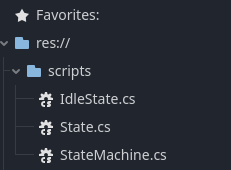

+++
title = "Godot Recipe: Finite State Machine #1"
date = 2023-10-13
description = "A walkthrough for implementing a basic FSM module in Godot C#"

[taxonomies]
tags = ["Godot", "recipe", "C#", ".NET", "FSM", "finite state machine", "character controller"]

[extra]
footnote_backlinks = true
quick_navigation_buttons = true
+++

> 🙋🏼 A huge thanks goes out to Robert Nystrom for writing the book [Game Programming Patterns](https://gameprogrammingpatterns.com/) and thus inspiring me to write this post!

> ⚠️ This post assumes you have basic understanding of Nodes and Scenes in Godot and some familiarity with C# syntax.

*Have you ever had your Character Controller code turn into proper spaghetti?*

I have -- and it's no fun.

While not a perfect cure, a **finite state machine (FSM)** can help you untangle a lot of the mess that builds up as you add more complexity to your character controller.

In this recipe series, we'll build an FSM module for Godot using C#.


The long term goal is to provide a module where an arbitrary `State` can control arbitrary `Systems` on our player character.

Along the line we'll make mistakes and questionable design decisions. This is how we learn!

> 🙋🏼 If you simply want a functioning FSM for your Godot project, I suggest heading over to the [Godot Asset Library](img/https://godotengine.org/asset-library/asset) and searching for available FSM plugins. There is no need to reinvent the wheel, **unless you want to!**

# Scope

At the end of this post, we will end up with a state machine that controls a simple Mover system that pushes a RigidBody3D around.


stateDiagram
    direction LR
    Player-->StateMachine: has a
    Player-->Mover: has a
    Mover-->Player: moves
    StateMachine-->Mover: controls


The FSM will support two states that we can transition between - idle and walking.


stateDiagram
Idle-->Walking: Pressing WASD
Walking-->Idle: Not pressing WASD


In future posts, we will iterate on the module, improving the design and architecture making it more generic and more loosely coupled -- so stick around! 🙂

# Project setup

Before diving into the code, we head on over to Godot and set up some WASD mappings for movement. We'll call the actions `up`, `down`, `left` and `right`:


Next, we setup a scene (let's call it `main.tscn`):

Add a RigidBody3D to the scene and call it `Player`. Then, add some visuals and a collider as children nodes. I'm using a capsule shape for both.

With the rigidbody selected, go to `Axis Lock` and check `Linear Y`, `Angular X` and `Angular Z`. This way the Player will ignore gravity and won't topple over.

In addition to this, set `Linear > Damp` to something like 5. This will prevent us from sliding around like crazy!

Finally, add a Camera3D and position it reasonably so it looks slightly down at the world origin. Your scene will look a little like this:


Now that we're all set up, let's get codin'!

# Defining a State

We decide that our states should be able to handle logic that executes:

* Upon **entering** the state
* During idle processing -- `Node._Process(double)`
* During physics processing -- `Node._PhysicsProcess(double)`
* Upon **exiting** the state

With this in mind, we sketch up a class that looks like this:


    classDiagram
    class State {
        Enter() void
        Tick(double) void
        PhysicsTick(double) void
        Exit() void
    }


> 🙋🏼 We will notice this definition changes throughout the series. For now, let's continue!

## Abstract State

Next we create an abstract State class with this definition in our project. I'll just plop it down right in a scripts folder for now.


We won't be inheriting from Node, but instead make this a pure C# class. We will also have it perform some basic logging in each method. 

Replace all contents of State.cs with the following:

```cs
using Godot;

public abstract class State
{
    private string _name;

    public State() {
        _name = GetType().Name;
    }

    public virtual void Enter() {
        GD.Print($"Entered {_name}");
    }

    public virtual void Tick(double delta) {
        GD.Print($"Ticking {_name}");
    }

    public virtual void PhysicsTick(double delta) {
        GD.Print($"Physics ticking {_name}");
    }

    public virtual void Exit() {
        GD.Print($"Exiting {_name}");
    }
}
```

## IdleState

In addition to this abstract State, let's create two *concrete* states - the `IdleState` and the `WalkingState`. Both inherit from `State` and, for now, does nothing except call the virtual methods on the base class, for now.

Create both scripts and but them in the `scripts` folder.

```cs
public class IdleState : State
{
    public override void Enter()
    {
        base.Enter();
    }

    public override void Tick(double delta)
    {
        base.Tick(delta);
    }

    public override void PhysicsTick(double delta)
    {
        base.PhysicsTick(delta);
    }

    public override void Exit()
    {
        base.Exit();
    }
}
```

## WalkingState

For the `WalkingState`, we will leave a TODO in the `PhysicsTick` function:

```cs
public class IdleState : State
{
    public override void Enter()
    {
        base.Enter();
    }

    public override void Tick(double delta)
    {
        base.Tick(delta);
    }

    public override void PhysicsTick(double delta)
    {
        base.PhysicsTick(delta);
        // TODO do some moving around!
    }

    public override void Exit()
    {
        base.Exit();
    }
}
```

Fantastic! We now have two states ready for use. To actually use them, we need to create the actual SM of our FSM.

Enter, the *state machine*!

# The State Machine

To enable our character to use our states, we need a controller of sorts to track and handle what state we are in and transitions to other states.

## Creating the machine

In its most simple form, a state machine is a state container that can call the state functions and change what state we are in. To make it clearly visible in the scene hierarchy, let's make it inherit from Node.

Let's sketch one up!


    classDiagram
    direction LR
    Node<|--StateMachine
    class StateMachine {
        - _currentState: State
        - DefaultState: State
        - ChangeState(State) void
    }


Similarly, we create a `StateMachine.cs` script and dunk it straight into our `scripts` folder. The story goes:

* We keep a list of all possible States in the machine and create them in the `_Ready` function.
* We decide on a default state for the machine and set it in the `_Ready` function.
* We keep track of the current state.
* We'll call the `Tick` and `PhysicsTick` state functions in `_Process` and `_PhysicsProcess` respectively.
* `ChangeState` handles calling the exit and enter logic on the states we transition between.

It looks something like this:

```cs
using Godot;

[GlobalClass] // NOTE allow creation in "Create New Node" in Godot
public partial class StateMachine : Node
{
    public IdleState idleState;
    public WalkingState walkingState;
    
    private State _currentState;

    public override void _Ready()
    {
        idleState = new IdleState();
        walkingState = new WalkingState();

        ChangeState(idleState); // initial state
    }

    public override void _Process(double delta)
    {
        _currentState.Tick(delta);
    }

    public override void _PhysicsProcess(double delta)
    {
        _currentState.PhysicsTick(delta);
    }

    // Switches to a new state, if it is different from the current state.
    public void ChangeState(State newState)
    {
        if (newState == _currentState) return;
        _currentState?.Exit();   // perform exit logic on current state
        _currentState = newState;   // switch to new state
        _currentState.Enter();   // perform enter logic on new state!
    }
}

```

> 🙋🏼 For now, let's keep the concrete states public - this will trick us into a circular dependency very soon, but we'll break that up in a later part of this series!

Our FileSystem should look like this, at this point:



Next we'll take our State Machine for a logging spin!

## Testing the machine

Add the StateMachine node anywhere in your scene. Hitting play should yield some logs:


While not particularly exciting, we are successfully idling! If you've come this far, take a short break and grab your drink of choice before continuing. Well done! ☕

Next, we'll be tackling transitioning to other states!

# State Transitions

We have states and we have a machine - all we need now is transitions between the states. It will take a little refactoring, so buckle up!

## Setting up our states and machine for transitioning

The conditions that decide if we should switch to another state will live inside our states. One way to change our state is to let our states call the `ChangeState` function on our machine. Let's do that for now!

Remember that circular dependency I warned about earlier? Don't blink, because it's happening now.

We will introduce a `StateMachine` reference in our states. It will sit snugly in the abstract State class like so and be assigned in the constructor:

```cs
public abstract class State {
    private string _name;
    protected StateMachine _machine;  // NEW!

    public State(StateMachine machine) { // UPDATE!
        _name = GetType().Name;
        _machine = machine; // NEW!
    }

    // omitting rest of file for brevity
```

> 🙋🏼 While it's not pretty, it does the trick for now. I promise you we'll sort this circular dependency atrocity out in the future!

Lastly, we update our concrete state constructors to pass the StateMachine down the base constructor. We also update our state constructions in `StateMachine.cs`:

```cs
// StateMachine.cs
public override _Ready()
{
    idleState = new IdleState(this); // Update
    walkingState = new WalkingState(this); // Update

    ChangeState(idleState);
}
```

```cs
// IdleState.cs constructor
public IdleState(StateMachine machine) : base(machine) { }  // NEW!
```

```cs
// WalkingState.cs constructor
public WalkingState(StateMachine machine) : base(machine) { } // NEW!
```

And with that, we have all the plumbing to perform state transitions! We are nearly there...

## Implementing transition conditions

We need to determine when to switch between the Idle and Walking states. For this, we tell `IdleState` that if we're moving with WASD, we should transition to walking. 

In `Tick` we poll for our transition condition like so:

```cs
// IdleState.cs
public override void Tick(double delta)
{
    base.Tick(delta);

    if(Input.GetVector("left", "right", "up", "down") != Vector2.Zero) {
        _machine.ChangeState(_machine.walkingState);
    }
}
```

In `WalkingState`, if we're not pressing WASD, we transition to `IdleState`.

```cs
// WalkingState.cs
public override void Tick(double delta)
{
    base.Tick(delta);
    
    if(Input.GetVector("left", "right", "up", "down") == Vector2.Zero) {
        _machine.ChangeState(_machine.idleState);
    }
}
```

At this point we have two states, a state machine and conditions in the states describing when to switch between the states.

## A simple Mover system

We will showcase our FSM using a really basic Mover:

```cs
using Godot;

[GlobalClass]
public partial class Mover : Node
{
    [Export] RigidBody3D rigidbody;
    [Export] float forceMultiplier = 20; // possibly a reasonable default?

    public void Move(Vector2 velocity)
    {
        Vector3 force = new(velocity.X, 0f, velocity.Y);
        rigidbody.AddConstantForce(force * forceMultiplier);
    }
}
```

Add the `Mover` node to the `Player` node, and assign the `Player` as the `rigidbody` in the Inspector. If you haven't already, this is also the time to add the `StateMachine` to your `Player`.


Next, add a public export reference to the Mover in our machine so that we can access it from our WalkingState. 

**Don't forget to assign the Mover in the Inspector afterwards!**

```cs 
public partial class StateMachine : Node
{
    public IdleState idleState;
    public WalkingState walkingState;
    
    private State _currentState;

    [Export] public Mover mover;
    // rest of file is omitted
```

> 🙋🏼 In a future post, we will improve the way we get the systems that are used in our states. At this point, it doesn't have to be perfect!

Finally, update the `WalkingState` to perform some movement in `PhysicsTick`:

```cs
// WalkingState.cs
public override void PhysicsTick(double delta)
{
    base.PhysicsTick(delta);
    Vector2 direction = Input.GetVector("left", "right", "up", "down");
    _machine.mover.Move(direction);
}
```

Just like that, we're ready for the big reveal.

## The final result

With no fear in your heart, press F5 in Godot and take her for a spin!


There we have it -- a fully functional FSM framework! This can be used to control all possible aspects of a character, if we put some more love into it.

Give yourself a compliment or two, you've earned it! 👏🏼

Experiment and play around with the FSM -- add some states, a new system, or try to break the circular dependency yourself. 

Have fun with it! ☀️

In the next part, I will show you how I solve the circular dependency. We will also improve the way we fetch systems in our states.

All the best,<br/>
Nilsiker