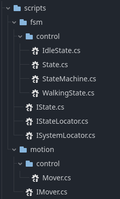

+++
title = "Godot Recipe: Finite State Machine #2"
date = 2023-10-21
description = "Solving circular dependencies and promoting loose coupling"

[taxonomies]
tags = ["Godot", "recipe", "C#", "finite state machine", "character controller", "namespaces", "abstraction", "solid"]

[extra]
footnote_backlinks = true
quick_navigation_buttons = true
+++

[< part 1](/blog/finite-state-machine-1)

> ⚠️ This post assumes you have a basic understanding of Nodes and Scenes in Godot and some familiarity with C# syntax if you plan to code along!

Last time, we left things in quite a mess.

A class overview of our current FSM looks like this:


classDiagram
direction TB
    class StateMachine {
        + ChangeState(State) void
    }
    class State {
        - _name : string
        + Enter() void
        + Tick(double) void
        + PhysicsTick(double) void
        + Exit() void
    }
    StateMachine --|> Node
    State --> StateMachine
    StateMachine --> WalkingState
    StateMachine --> IdleState
    StateMachine --> State
    StateMachine --> Mover
    <<abstract>> State
    WalkingState --|> State
    IdleState --|> State
    Mover --> RigidBody3D
    namespace Godot {
        class RigidBody3D
        class Node
    }


It might not look *too bad* at this point. If I recall, our demo showcase proved that our basic movement system worked! So why bother with all this?

Once we start adding more systems, more states and (cue foreshadowing) a way for our states to handle external events, this setup will swiftly become a breeding ground for logical errors and hard-to-maintain code.

My pain points at the moment are:

* We're not using any organizational tools to categorize our classes
* `State` and `StateMachine` form a circular dependency
* States need to access other states through the StateMachine
* `WalkingState` need to access `Mover` through the StateMachine
* Overall, classes are too dependent on concrete classes (tight coupling)

Let's make a plan to solve this and prevent future headaches!

> ⚠️ The tips and techniques shown below are workflows and structures I've found works well for me. There might be more idiomatic ways to achieve modularity and encapsulation in Godot.

# Scope

The goal for this post is to utilize the Dependency Inversion Principle (DIP) to kill off our circular dependency and make our code more loosely coupled. We will briefly touch on the Liskov Substitution Principle (LSP) and what it means for our code examples.

We will also be introducing a Locator pattern to improve how states get a hold of systems and other states.

In addition to this, we'll organize or classes into namespaces to give our codebase some well-needed structure. 

We'll also honour the Interface Segregation Principle, but after that we put a LID on [SOLID](https://en.wikipedia.org/wiki/SOLID) for now (sorry not sorry).

We'll end up with something that looks like this:


graph
    subgraph FSM
        State--implements-->IState
        State--has-->ISystemLocator
        State--has-->IStateLocator
        subgraph Control2[Control]
            State
            IdleState
            WalkingState
            StateMachine
            IdleState--inherits-->State
            WalkingState--inherits-->State
        end
        StateMachine--has-->IState
        StateMachine--implements-->IStateLocator
        StateMachine--implements-->ISystemLocator
    end
    subgraph Motion
        subgraph Control
        Mover
        end
        IMover
        Mover--implements-->IMover
    end
    WalkingState--has-->IMover
    Mover--has-->RigidBody3D
    StateMachine--inherits-->Node
    subgraph Godot
        Node
        RigidBody3D
    end


> 🙋🏼 Not a class diagram, I know -- Mermaid doesn't support nested namespaces in class diagrams yet, but subgraphs in flowcharts kinda does the trick.

We've got some refactoring to do, let's go!

# Using namespaces for organization

I like my classes to belong to a well-defined module. To help me enforce this, I use C# namespaces.

I follow a convention where the root namespace is the name of my project, let's say `Project`. Publically available interfaces live in a nested namespace called the same as the module, let's say `Project.FSM`. Classes that perform logic that is internal to the module live in yet another nested namespace in that module, let's say `Project.FSM.Control` for logic. 

> 🙋🏼 If we want to separate logic and data, I would also introduce the namespace `Project.FSM.Models` or `Project.FSM.Data` -- a [Model-View-Controller approach](https://sv.wikipedia.org/wiki/Model-View-Controller)!

All classes are updated to use this convention. The class-namespace mapping looks like this currently:

* Project.FSM.Control
    * State
    * IdleState
    * WalkingState
    * StateMachine
* Project.Motion.Control
    * Mover

Optionally, you can mimic the namespace structure in the project folder structure. I always do this.


Following this namespace convention, it shows that all our classes are Control classes and shouldn't be exposed publically. We'll sort this out by introducing interfaces as we go along.

# Solving circular dependencies using DIP

DIP stipulates the following:

* A high-level class mustn't depend on a lower-level class
* Abstract classes and interfaces should not depend on concrete classes
* Concrete classes should depend on abstract classes and interfaces

Its goal is to create a more robust and maintainable solution. How does this relate to our current code?

In our current setup, the state is a `lower-level class` and the machine is a `higher-level class`. States should not need to know anything about state machines - not even that they exist. In turn, state machines should not care about state details - they should only depend on an abstraction of states.

How do we achieve this? It might come off as a bit esoteric, but it's not that weird in practice!

# Adding Locator and IState interfaces

The states do not need the state machine itself. What they do need is a way to access systems, so they can control aspects of the character controller. They also need to relay WHEN to transition to another state, and WHAT state to transition to.

The way I tackle this, is that I introduce two interfaces: `ISystemLocator` and `IStateLocator` in `Project.FSM` and have StateMachine implement them. The goal here is to keep the fetching of systems and states as generic as possible.

I also introduce an `IState` interface in `Project.FSM`, so that our `IStateLocator` can depend on an interface rather than an abstract class. Similarly, all references to states in `StateMachine` can instead reference the `IState` interface

```cs
public interface IState 
{
    void Enter();
    void Tick(double delta);
    void PhysicsTick(double delta);
    void Exit();
}

public interface ISystemLocator
{
    // NOTE you could introduce an interface constraint here
    T Get<T>();
}

public interface IStateLocator
{
    T Get<T>() where T : IState;
}
```

As a matter of fact, we can fully generalize the Locator pattern. I'll make one *general* Locator, and one *generic* one where you can specify constraints. I'll put them in a namespace called `Project.Core`. Both ways are viable. This generic one might be a bit overengineered, but I'll use it for now!

```cs
namespace Project.Core {
    public interface ILocator
    {
        T Get<T>();
    }

    public interface ILocator<T>
    {
        U Get<U>() where U : T;
    }
}
```

> ⚠️ This `ILocator` definition is left out of the class overview at the top of this post. They made the diagram very hard to follow.

The abstract `State` is updated to implement `IState`. Concrete `State` classes are updated to store references to `ILocator` and `ILocator<IState>` instead of `StateMachine`.

# Shifting state-changing responsibility to StateMachine

I lied, the LID is officially off as we leverage the Single Responsibility Principle (S).

> 🙋🏼 You could say it SLID off.

The responsibility to call ChangeState is shifted from `State` to `StateMachine`. Since the new interfaces don't expose the `ChangeState` function, we instead return the result of `ILocator<IState>.Get<T>()` to the `StateMachine` where it can handle state-changing internally. The `IState` interface is updated to return `IState` on our tick functions for usual condition checks.

In doing so, `StateMachine.ChangeState(State)` can be made *private*. 💡

You could also add an IState return type to `Enter` if you feel like it, for really early state change guards. I won't for now!

```cs
public interface IState 
{
    void Enter();
    IState Tick(double delta);
    IState PhysicsTick(double delta);
    void Exit();
}
```

The StateMachine class are updated implement the Locator interfaces. I decide to keep the states inside the StateMachine using a list.

For now, I decide to have all systems under a Node called *Systems*. We export this and assign it in the Inspector.

```cs
using System.Collections.Generic;
using System.Linq;
using Godot;

public partial class StateMachine : Node, ILocator, ILocator<IState>
{
    [Export] private Node _systems;
    private List<IState> _states;
    private IState DefaultState => (this as IStateLocator).Get<IdleState>();
    private IState _currentState;

    public override void _Ready()
    {
        _states = new List<IState> // Construct your states in the list
        {   
            new IdleState(this, this),
            new WalkingState(this, this)
        };

        ChangeState(DefaultState);
    }

    // other methods

    T ILocator<IState>.Get<T>()
    {
        return _states.OfType<T>().FirstOrDefault();
    }

    T ILocator.Get<T>()
    {
        return _systems.GetChildren().OfType<T>().FirstOrDefault();
    }
}
```

> 🙋🏼 Using `OfType<T>` from LINQ might not be the optimal way to do state and systems fetching. However, I find it very ergonomic as it allows me to work strictly with types in the state logic. If you have another neat way to solve this, I'd love to hear about it!

Given these changes, we have to move around and refactor our states a bit.

As an example, `WalkingState` ends up looking like this after the changes:

```cs
using Godot;

using Project.Systems;

namespace Project.FSM.Control
{
    public partial class WalkingState : State
    {
        public WalkingState(ILocator<IState> states, ILocator systems)
            : base(states, systems) { }

        public override void Enter()
        {
            base.Enter();
        }

        public override IState Tick(double delta)
        {
            IState stateFromBase = base.Tick(delta);

            return Input.GetVector("left", "right", "up", "down") == Vector2.Zero
                ? states.Get<IdleState>()
                : stateFromBase;
        }

        public override IState PhysicsTick(double delta)
        {
            Vector2 direction = Input.GetVector("left", "right", "up", "down");
            systems.Get<Mover>().Move(direction);

            return base.PhysicsTick(delta); ;
        }

        public override void Exit()
        {
            base.Exit();
        }
    }
}
```

The `StateMachine` is updated to handle potentially returned states from the tick functions:

```cs
public partial class StateMachine : Node, ILocator<IState>, ILocator
{
    // more code...

    public override void _Process(double delta)
    {
        var newState = _currentState.Tick(delta);
        if(newState != null) {
            ChangeState(newState);
        }
    }

    public override void _PhysicsProcess(double delta)
    {
        var newState = _currentState.PhysicsTick(delta);
        if (newState != null)
        {
            ChangeState(newState);
        }
    }

    // more code...
}
```

Finally, make sure the scene structure is updated to respect that systems are expected to be children of the Systems node:


Hitting play should show that the StateMachine works just as before.

> 🙋🏼 I admit it's a lot of work for no new functionality, but it should help us do better design choices moving forward and provide us a framework on how to organize our systems.

# A brief comment on Liskov substitution

This principle states that you should be able to substitue an object with a sub-object without anything breaking.

By introducing `IState` and continue using our `StateMachine` as if nothing changed, we assume (🚩) that our code passes the Liskov substitution test. The machine should accept any object implementing `IState` and still work as expected. It seems to hold true for `IdleState` and `WalkingState`, but we should be wary as our module grows with increasingly complex interactions.

The same goes for systems -- next let's do some abstractions for our Mover!

# Loose coupling for systems

We loosened up our coupling by introducing the `IState` interface. We can do one better and let Mover implement the IMover interface:

```cs
public interface IMover
{
    void Move(Vector2 direction);
}
```

The states can now also be updated to save references for the systems they need. On construction, `WalkingState` locates and stores the reference to the IMover.

```cs
namespace Project.FSM.Control
{
    public partial class WalkingState : State
    {
        private IMover _mover;

        public WalkingState(ILocator<IState> states, ILocator systems) 
        : base(states) 
        {
            _mover = systems.Get<IMover>();
        }
        
        // more code
    }
}
```

As shown above, states only need to locate and store the systems as they are constructed.

Therefore, we can do away with the persistent `ILocator` reference in the abstract `State` class.

```cs
namespace Project.FSM.Control
{
    public abstract class State : IState
    {
        private string _name;
        protected ILocator<IState> states;

        public State(ILocator<IState> states)
        {
            _name = GetType().Name;
            this.states = states;
        }

        // more
    }
}
```

Now this is neat!

# Trying out our new architecture

If your folder structure is a reflection of the namespaces, our scripts folder should look rather tidy now.



With this new setup, what does it look like to add a new system? I'll add a contrived system that changes the Player color and decide that the Player turns blue while idling and red while walking.

The folder structure would hade this added to it:


And this code would be added:

```cs
// IAppearanceChanger.cs
namespace Project.Appearance 
{
    public interface IAppearanceChanger
    {
        void ChangeColor(Color color);
    }
}
```
```cs
// AppearanceChanger.cs
using Godot;

namespace Project.Appearance.Control
{
    public partial class AppearanceChanger : Node, IAppearanceChanger
    {
        [Export] private CsgMesh3D _visuals;

        private StandardMaterial3D mat = new StandardMaterial3D
        {
            AlbedoColor = new Color(1, 1, 1)
        };

        public override void _Ready()
        {
            _visuals.Material = mat;
        }

        public void ChangeColor(Color color)
        {
            mat.AlbedoColor = color;
        }
    }
}
```
```cs
// IdleState.cs
public partial class IdleState : State
{
    private IAppearanceChanger _appearance;

    public IdleState(ILocator<IState> states, ILocator systems)
        : base(states) 
    {
        _appearance = systems.Get<IAppearanceChanger>();
    }

    public override void Enter()
    {
        base.Enter();
        _appearance.ChangeColor(new Color(0,0,1));
    }

    // more code
}
```


Similarly, I locate the Appearance system in `WalkingState`, and change the color to red -- et voilà!


# End result

I've rambled a lot about software design, which can quickly become dull. If you've made it this far -- great job!

How did we fare? Did all this nonsense actually solve anything? Let's address my introductory pain points:

|Problem|Plan|Solution|Solved|
|-|-|-|-|
|*Poor code organization*|Introduce namespaces| i.e. `Project.FSM.Control`|✅|
|*Circular dependency*|Inverting dependency using interface| i.e. `IState`|✅|
|*Tight coupling for states fetching states*|Use Locator pattern for states | `ILocator<IState>` |✅|
|*Tight coupling for states fetching systems*|Use Locator pattern for systems | `ILocator` |✅|
|*Tightly coupled classes*| Depend on interfaces, Liskov substitution in mind |`IMover` `IAppearanceChanger`|✅|

Our states no longer expect concrete implementation to solve our needs.

They simply ask for a reference to ***any*** object that fulfills a specific contract -- the interface.

> 🙋🏼 A real neat thing is that we can track dependencies by gauging the `using` statements in our classes. If we see any Control class use another module's Control namespace, that's a red flag now and we're probably missing an interface.

Next post, we will take a look at event-handling support in states. This way, polling conditions in ticks won't be the only way to trigger logic or state transitions in our FSM!

If you're feeling curious, try your hand at setting it up yourself! ☀️

All the best,<br/>
Nilsiker

[source code here](https://github.com/Nilsiker/godot-fsm/releases/tag/part2)
