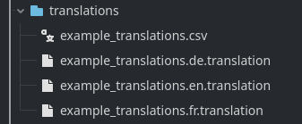
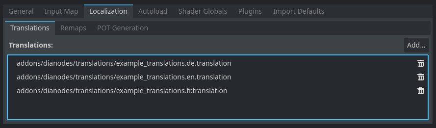
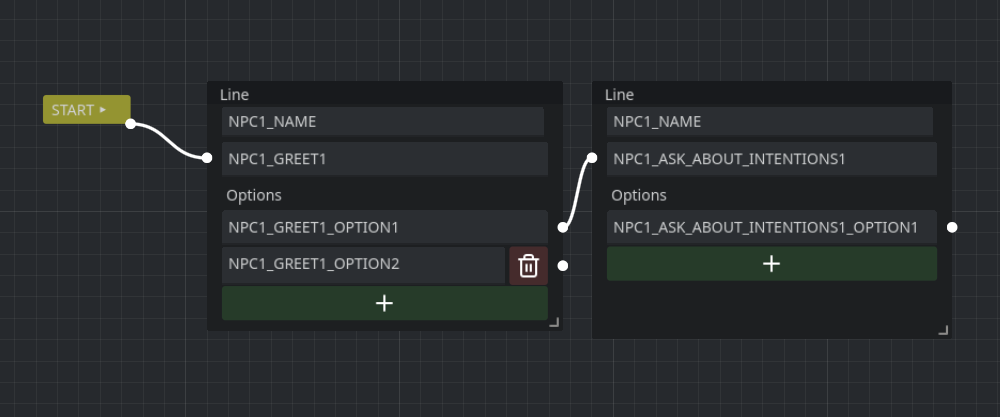
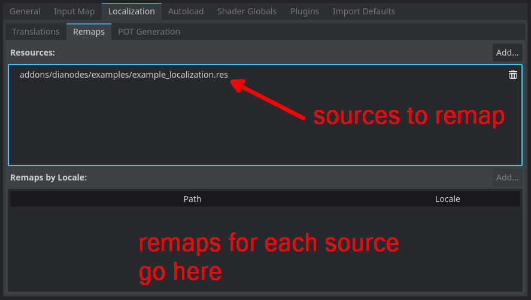

+++
title = "Designing translatable dialogues in Godot"
date = 2024-06-16
description = "An exploratory article about handling translation and localization in Godot."
draft = true

[taxonomies]
tags = ["godot", "localization", "i18n"]

[extra]
footnote_backlinks = true
quick_navigation_buttons = true
+++

# Introduction

I'm currently working on a dialogue editor for Godot called [Dianodes](https://github.com/Nilsiker/dianodes). It is still in early development and hopefully I will soon be able to share it with the community.

I want to make sure my plugin supports translating dialogues, while still maintaining a smooth interface and workflow for dialogue designers. Ideally, designers should be able to handle all translation from the dialogue editor.

So, how do I ensure that Dianodes supports a pleasant user experience and still plays nicely with the Godot way of handling i18n? 

Let's try and figure this out!

# Scope

In this article we will explore how to handle translation and localization and make my plugin conform to how Godot handles it. Based on the official documentation, we will outline a plan for the plugin.

Hopefully, it will help you understand how to implement this in your own for similar projects!

And even better, if you feel I'm going off track, please let me know!

# Research

Hitting the Godot docs, I quickly stumble upon a tutorial on [Internationalizing games](https://docs.godotengine.org/en/stable/tutorials/i18n/internationalizing_games.html). However, it recommends you start off with [Importing translations](https://docs.godotengine.org/en/stable/tutorials/assets_pipeline/importing_translations.html#doc-importing-translations) - who am I to say otherwise?

There seem to be two main ways to handle translations in Godot; both include a key-value pair format, where the more approachable one is using `.csv` files. The other approach is using `.po` files. 

I'm not sure which one is better for my plugin. To get things started we'll have a look at the `.csv` approach since that is described as the easier alternative.

## Translations using CSV

Using comma-separated values a translation file looks like this - paying attention to case sensitivity:

| keys               | en     | de     | fr       |
| ------------------ | ------ | ------ | -------- |
| EXAMPLE_NPC_GREET1 | Hello! | Hallo! | Bonjour! |

After creating `example_translations.csv` in my project, the importer in Godot does its magic and creates the following resources:

The next step is to add the translations to the project through the `Project > Project Settings > Localization > Translations` menu.

Using this approach my plugin would need to reference the translation keys when editing dialogues instead of writing out the text strings. Instead, you would edit the corresponding key in the CSV file when updating the text strings.

It would be viable to solely depend on key referencing, but this would result in an editor experience looking like this:

You quickly lose sense of the dialogue context and have to rely on the translations file to orient yourself. This is not ideal, especially if you want to iterate on the dialogue!

A naive alternative would be to use the localization remaps functionality, but this would require you to add a new Dialogue for every language you want to support, maintaining not only the text contents but the whole dialogue structure, with nodes and connections!

That is too tedious to be reasonable - remaps are not designed with text translation in mind, but is rather focused on localizing for instance audio and imagery. Not a good fit for dialogues, in other words.

# Design

It seems to me the best approach would be to allow dialogue designers to hook up text strings to translation keys, that are then merged with the dialogue translation file.

Right off the bat, the editor should include a dropdown specifying what locale you are currently editing. For each localizable string, it should also provide a key field so that the designer can specify what translation key the string relates to.

For convenience, the editor should allow the user to hide and show these key fields at their leisure. This would help declutter the UI and allow designers to choose whether they want to focus on dialogue content or localization setup.

Then designer for an opened dialogue would be:


flowchart LR
    B((Editing dialogue))
    C([editor content is updated to reflect new locale])
    D{key present}
    F([update translation file for selected locale and key])
    B-- change locale -->C
    C-->B
    B--edit field-->D
    D--yes-->F
    D--"no"-->B
    F-->B


The plugin would need to create a general `translation_dialogues.csv` resource when enabled. This file would contain the translation keys and their translated values. It would be loaded at startup, and then updated as the designer pushes the edits from the editor.

Using the autoload singleton `DialogueChannel`, the text strings would be replaced with the appropriate translation key when emitting signals. If no key can be found (in other words, no translation is supported for the text) it would fall back on the static string entered.

## Managing state complexity

The state management of the editor increases in complexity as the suggestion above introduces another layer - the translation file. 

Going with this design the resource data will act as a editing cache for the translation file, and in the case of missing keys - a fallback.

At the moment all dialogue information is kept in the resources and is passed around using the `DialogueChannel`. It is fairly trivial to have the channel perform a `tr(KEY_GOES_HERE)` lookup and handle translation misses by falling back on the string specified in the line.

# Implementation

...
