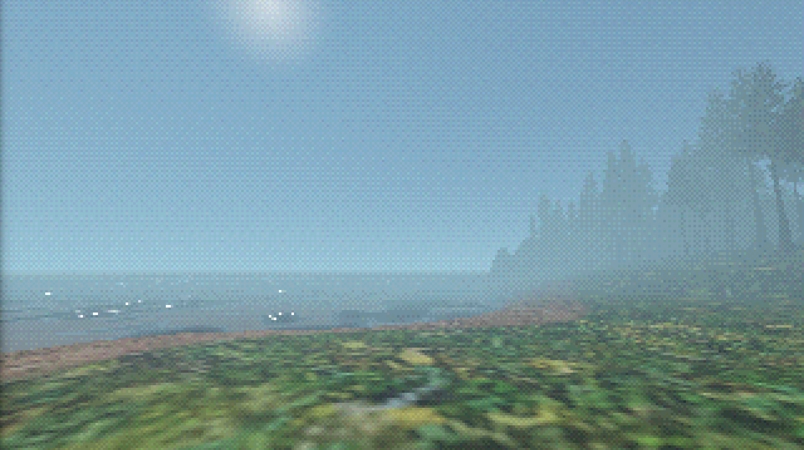
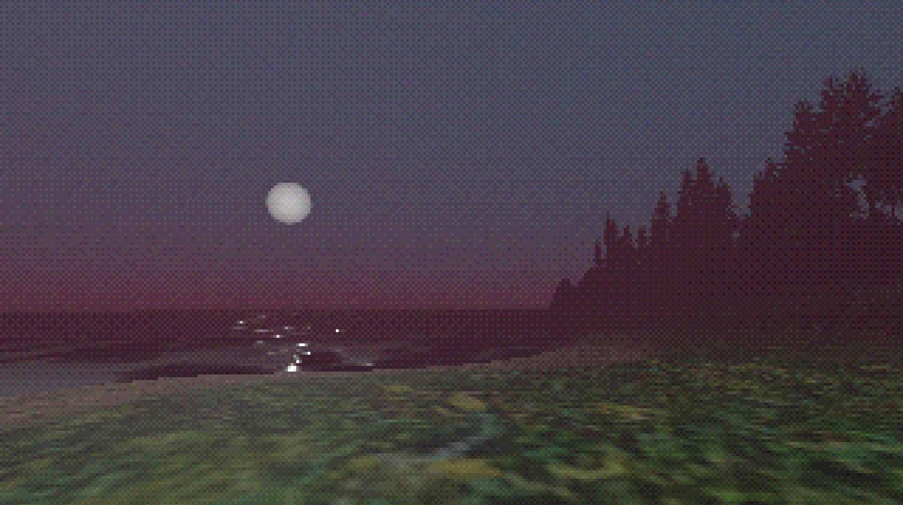

+++
title = "Vardag Dev Log #1: Lo-Fi Everyday Horror"
date = 2024-04-01
description = "A fuzzy introduction to the Vardag series."
draft = true

[taxonomies]
tags = ["godot", "horror", "gamedev"]

[extra]
footnote_backlinks = true
quick_navigation_buttons = true
+++

_You wake up to your 12 AM alarm kindly reminding you that you've booked the midnight laundry slot._

_The buzz of fluorescent light is heard overhead as you flip the switch to light your way to the basement laundry room._

_You get the feeling something is not right. A feeling of being watched._

**_What if this time, it's not just a feeling?_**

# Entirely Too Many Words On Inspirations

> 🙋🏼 If you know, you know.

I've historically had issues pinpointing exactly what I search for in horror narratives.

It needs supernatural elements, but mustn't be too overt or rely on the element of surprise. I don't want answers handed to me, and I always prefer an eerie slow-burn.

Like many others I recently finished Alan Wake 2 by Remedy Entertainment, and it almost flawlessly delivers the perfect contemporary eldritch horror narrative for me.

The creative director at Remedy [was interviewed by GamesBeat](https://venturebeat.com/business/sam-lake-interview-how-storytelling-can-create-so-much-value-in-games/) where he talks about the Control setting. In it, he describes my feelings well with this quote:

> _I find my interest sparked when something is well-made and it feels to me like I’m not quite smart enough to understand everything._
>
> -- Sam Lake

After getting up to speed with the Remedyverse and taking Sam's words above to heart, I think a good term for my particular taste in horror is _ethereal horror_.

Horror that, despite its vague presence, manages to instill dread and suffocate with its esotericity.

Horror that describes the events leading up to the awakening of Deep Sleeper, or the stories of the people stumbling upon the omens appearing before the reign of the Yellow King.

> 🙋🏼 Maybe that's just Lovecraftian? But less fantastical? It's probably best not to think too hard about it.

That is what I hope to show you with **Vardag**, a horror game anthology I've started working on.

# What is Vardag, precisely?

Vardag is the Swedish word for _weekday_, _workday_ or _everyday life_. It is also the name of my planned game series, focusing on _ethereal_ everyday horror.

I say game series optimistically. Naturally it starts with one game; _Vardag - A Dog Walk_, a short horror scenario starting with you taking your dog for a walk by the lake in a forest close to your home.

Technically it's a lo-fi first-person, interactive narrative experience created in Godot. You might call it a walking simulator.

> 🙋🏼 If you do, I hope you're doing so without negative connotations!

I'm planning on releasing to Windows and Linux.

# The Road Forward

Currently, I'm doing inventory on what tools to use to finish the vision for the first installment of Vardag. I've settled on Godot and Blender, but there's a lot of things that are undecided as of writing this.

I haven't decided on workflows and tools for audio and SFX. The same goes for textures.

Much like _ethereal horror_, there are a lot of unknowns.

Or maybe there aren't?

At this point I should really just get my thumbs out and start pushing those vertices -- I'm missing 3D models for a quaint nature reserve!

_Thanks for reading, hope to scare you in the future!_ 
_Nilsiker_

